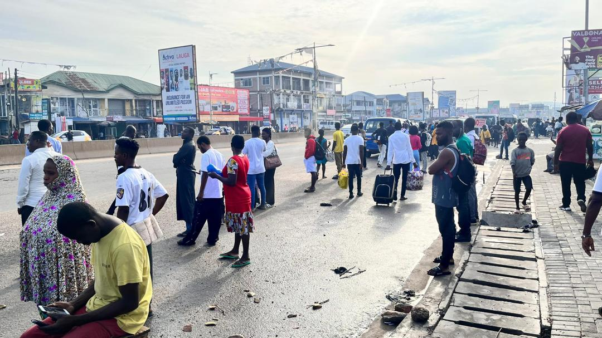

# How a 15% fare cut exposed Ghana’s commuter chaos

**Author:** Charles Sarpong Amponsah  
**Project Type:** Scroll-driven visual story with Mapbox GL JS  
**Live Version:** [View the project here](https://ksarpongg.github.io/fare-cut-scroll/)  
**WordPress Embed:** [Embedded version](https://www.gbcghanaonline.com/features/fare-cut-millions/2025/)

---

## 🎯 Overview

In 2025, Ghana announced a 15% reduction in public transport fares. The decision was influenced by recent macroeconomic trends — particularly the sustained appreciation of the Ghanaian cedi against the US dollar, which contributed to a notable drop in fuel prices.

But on the ground, many commuters experienced something different: fare manipulation, unapproved route changes, and a broken enforcement system.

This scroll-driven visual story uses live satellite maps and interactive scrolling to expose the real cost of a fare cut that never reached many commuters.

---

## 🚍 What the Visualisation Shows

- A mapped journey from **Kasoa** to **Circle**, highlighting fare manipulation hotspots
- Sticky, animated Mapbox scenes that reveal:
  - Where the announced fare cut was ignored
  - How routes were unofficially shortened mid-journey
  - Visual markers of every key bus stop along the route
- Field photography from major transport points
- An interactive journey where the map responds to the story

---

## 🧰 Tools & Technologies

- **Mapbox GL JS v2.15** for scroll-linked satellite visuals  
- **Scrollama.js** for scroll-triggered transitions  
- **HTML, CSS, JavaScript** for structure and animations  
- **Live satellite maps** via Mapbox `satellite-v9` style  

---

## 🔐 Access Token Safety

This project uses a **restricted Mapbox access token**, safely embedded in `config.js`.

To ensure security:
- The token is restricted by domain: `https://ksarpongg.github.io/*`
- It has read-only scope: `styles:read`
- No secret tokens, write access, or user-specific permissions are exposed

🛠️ The project was developed locally — files were prepared on a local machine and then uploaded to GitHub.  
A full-access `secrets.js` file (excluded from Git) was used during local testing, but **is not included** in the public repository.

✅ The token currently in this repo is safe for public use and secure for GitHub Pages hosting.

---

## 🛠️ Built With

- [Mapbox GL JS v2.15](https://docs.mapbox.com/mapbox-gl-js/) — for satellite map rendering and transitions  
- [Scrollama.js](https://github.com/russellgoldenberg/scrollama) — for scroll-driven storytelling  
- HTML, CSS, and JavaScript — for structure, styling, and interactivity  
- Custom field photography — taken at key bus stops along the Kasoa–Circle route  

---

## 🚀 Deployed On

- [GitHub Pages](https://ksarpongg.github.io/fare-cut-scroll/) — for free and public web hosting  
- [WordPress (GBC Ghana)](https://www.gbcghanaonline.com/features/fare-cut-millions/2025/) — embedded for wide reach and audience engagement  

---

## 📸 Credits

- Story, photography, map development: Charles Sarpong Amponsah  
- Inspired by storytelling formats from *The San Francisco Chronicle* and *The Africa Report*

---

## 🏆 Why This Project Matters

This project blends investigative reporting with immersive digital storytelling. It reveals how top-down policy fails when met with weak enforcement and local manipulation — a daily cost borne by millions of Ghanaians.

---

## 📬 Contact

For collaborations, interviews, or media use:

**Email:** ksarpongg@gmail.com  
**WhatsApp:** +233244987043  
**Twitter/X:** [@charamponsah](https://x.com/charamponsah)

---
